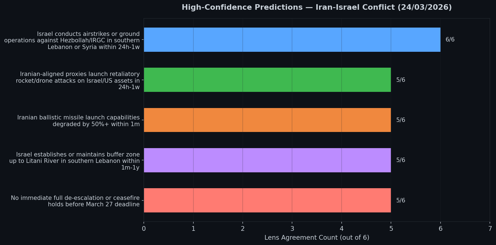
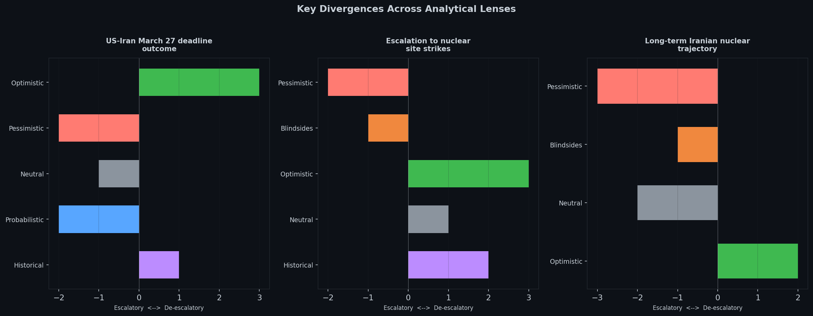

# Iran-Israel-US Conflict Trajectory (24/03/2026)

An open-sourced geopolitical forecast run produced by [Geopol Forecaster](https://github.com/danielrosehill/Geopol-Forecaster).

## Stack

- [Snowglobe](https://github.com/IQTLabs/snowglobe) (IQTLabs) -- multi-lens geopolitical simulation framework
- [LLM Council](https://github.com/karpathy/llm-council) (Karpathy) -- multi-model deliberation protocol

## Context

This forecast was run on **Day 25** of the Iran-Israel-US conflict, which began on 28 February 2026. At the time, President Trump had announced a 5-day delay on Iranian energy strikes with a **March 27 deadline** for Iran to comply with US demands. The situation involved active Israeli operations against Hezbollah and IRGC targets in Lebanon and Syria, ongoing Iranian proxy retaliations, and coalition strikes degrading Iranian missile infrastructure.

## High-Confidence Predictions

All five high-confidence predictions achieved strong consensus across 5-6 of 6 analytical lenses:

| Prediction | Agreement | Confidence |
|---|---|---|
| Israel conducts airstrikes or ground operations against Hezbollah/IRGC in southern Lebanon or Syria within 24h-1w | 6/6 lenses | Very High |
| Iranian-aligned proxies launch retaliatory rocket/drone attacks on Israel/US assets in 24h-1w | 5/6 lenses | High |
| Iranian ballistic missile launch capabilities degraded by 50%+ within 1m | 5/6 lenses | High |
| Israel establishes or maintains buffer zone up to Litani River in southern Lebanon within 1m-1y | 5/6 lenses | High |
| No immediate full de-escalation or ceasefire holds before March 27 deadline | 5/6 lenses | High |



## Key Divergences

The analytical lenses diverged most sharply on three topics:

### 1. US-Iran March 27 Deadline Outcome
- **Optimistic**: Preliminary security understanding with nuclear concessions
- **Pessimistic**: Failed talks trigger US energy strikes
- **Neutral**: Pause discarded due to continued Iranian fire
- **Probabilistic**: Energy strikes on March 28
- **Historical**: Deadline extended or partial framework

### 2. Escalation to Nuclear Site Strikes
- **Pessimistic**: Israel strikes Natanz/Fordow
- **Blindsides**: IDF strikes Natanz (low prob)
- **Optimistic**: Verification protocols avoid strikes
- **Neutral**: No nuclear strikes; attrition instead
- **Historical**: No nuclear strikes occur

### 3. Long-Term Iranian Nuclear Trajectory
- **Pessimistic**: Weapons-grade breakout prompting preemption
- **Blindsides**: Underground test or halt concession
- **Neutral**: Clandestine dispersed underground program
- **Optimistic**: Revised framework delays by years



## Accuracy Analysis

This forecast was produced **16 days before the April 8 ceasefire**. With the benefit of hindsight:

### Correct Predictions

- **Continued Israeli operations at full intensity** -- CORRECT. The IDF continued strikes through to the ceasefire.
- **Iranian proxy retaliations would continue** -- CORRECT. Hezbollah maintained attacks throughout the period.
- **Degradation of Iranian missile capabilities** -- CORRECT. Coalition strikes destroyed approximately 330 of 470 known launchers.
- **March 27 deadline would likely fail** -- CORRECT. No deal was reached by the March 27 deadline.
- **IDF would maintain/extend Lebanon buffer zone** -- CORRECT. The IDF reached the Litani River.

### Incorrect or Uncertain

- **Ceasefire considered unlikely** -- INCORRECT. A ceasefire was ultimately reached on April 8, which the forecast assessed as improbable at the time of the run.
- **Nuclear facility strikes predicted with moderate probability** -- DID NOT OCCUR. No strikes on nuclear facilities took place during the ceasefire window.

## Repository Contents

```
Iran-Israel-Conflict-Trajectory-240326/
  report/
    00-isw-analysis.md          # ISW analysis input
    00-news-headlines.md        # News headlines seed data
    01-ground-truth.md          # Ground truth at time of run
    02-sitrep.json              # Structured situation report
    03-forecasts.json           # Full forecast output (main artifact)
    04-summary.json             # Consensus themes, divergences, predictions
    report.pdf                  # Rendered PDF report
    report.typ                  # Typst source for PDF
  code_snapshot/
    geopol/                     # Python package snapshot at time of run
    pyproject.toml              # Project configuration
  graphics/
    high_confidence_predictions.png
    key_divergences.png
```

## Source Code

Full source code for Geopol Forecaster: [danielrosehill/Geopol-Forecaster](https://github.com/danielrosehill/Geopol-Forecaster)

## Author

Daniel Rosehill -- [danielrosehill.com](https://danielrosehill.com)

## License

This work is licensed under [CC BY 4.0](https://creativecommons.org/licenses/by/4.0/).
